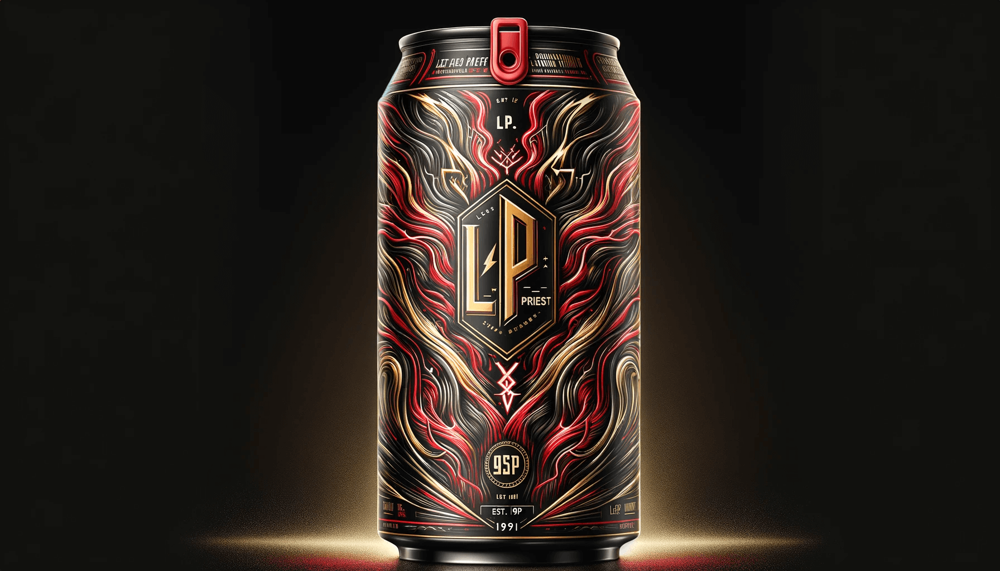
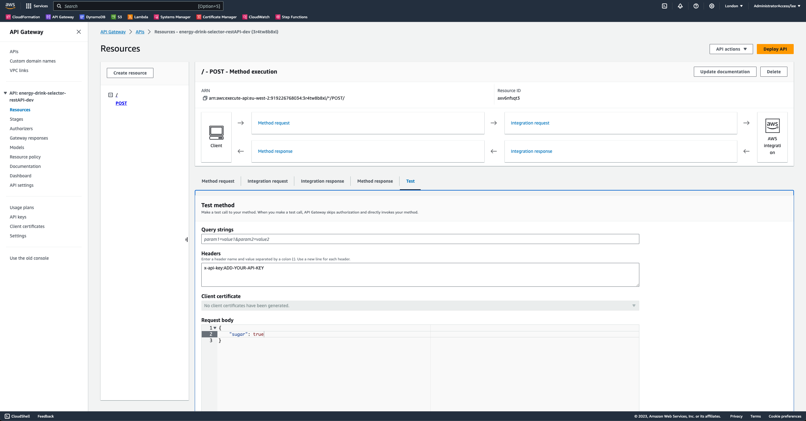
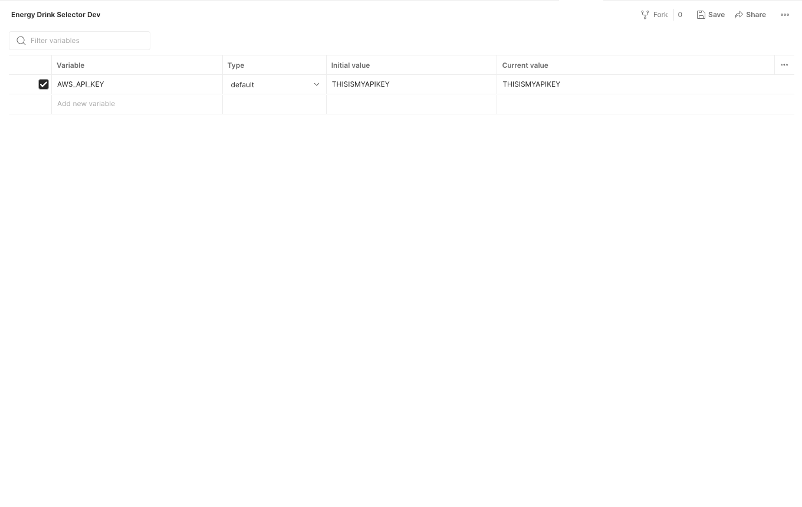
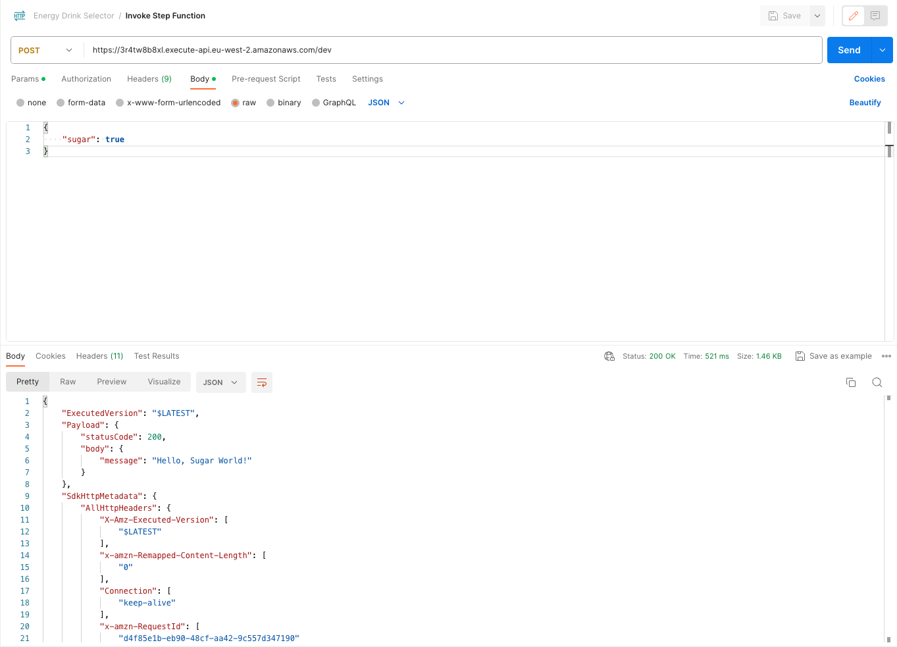

# Let's CDK: The Energy Drink Episodes



This repository is part of a 'Let's CDK' series that introduces you to AWS Cloud Development Kit (CDK) and how it can be used to create an application. The series also introduces you to the core concepts of AWS CDK, how you can deploy to your AWS account, and how services like AWS Lambda Functions, DynamoDB, Step Functions and more can all be used when working with CDK.

This application is pretty bare bones and this is on purpose. AWS CDK constructs are used directly from the AWS provided libraries without any libraries abstracting away any logic. This allows us to focus on learning the core concepts as implemented by AWS and not learning abstractions.

## List of Posts

1. [Let’s CDK: The Energy Drink Episodes](https://medium.com/aws-in-plain-english/lets-cdk-the-energy-drink-episodes-d23881031484)
2. [The Energy Drink Episodes 2: The Rise Of The Amazon API Gateway](https://medium.com/aws-in-plain-english/the-energy-drink-episodes-2-the-rise-of-the-amazon-api-gateway-e43c49c00ce5)
3. [The Energy Drink Episodes 3: The Step Function Awakens](https://medium.com/aws-in-plain-english/the-energy-drink-episodes-episode-3-the-step-function-awakens-e724546ddb2d)
4. The Energy Drink Episodes 4: The Return Of The Lambda Functions

## AWS Services Used

- DynamoDB
- Step Functions
- Lambda Functions
- IAM
- API Gateway

## Getting Setup

You will need to make sure that you are able to deploy code to your AWS account via the terminal. You can find a guide on how to get [setup for this here](https://docs.aws.amazon.com/cdk/v2/guide/getting_started.html). You will also need to make sure you have [Node.js 14.15.0 or later installed](https://nodejs.org/en/download). You can install Typescript by running ```npm install -g typescript```. Running ```npm install -g aws-cdk``` will install AWS CDK for you.

Getting setup with the app is pretty straightforward:

- Clone the repo to your machine
- cd in to the newly clone directory and run ```yarn```
- Deploy to your AWS account by running ```cdk deploy```


## Try It Out
There are a couple of ways we can try out the application:

### Via the AWS console 

In the AWS console, if you navigate through to API Gateway and find our new POST request, you will see that it is possible to test the endpoint. There are two things you'll need in order to test using this method. The first of these is an API key. This should be easy enough to find in the API Gateway console. Make sure to add it in the headers text box in the following format: ``x-api-key:YOUR-API-KEY``. The second is the payload to use. In the 'Request body' box, you can use the following payload: ``{ "sugar": true }``. It should look a little something like this:



There's an orange 'test' button under the request body box that you can click to trigger the test. Once it has run, you'll see an execution output, and you'll also be able to visit the Step Functions console to see the execution.

### Postman

Another method we can use to hit our new endpoint and trigger the Step Function is using an app like [Postman](https://www.postman.com/). In Postman, we can configure an environment and a collection that we can use to send requests to our API. Once you have downloaded Postman, open it up, create a new environment and give it a name like 'Energy Drink Selector Dev'. Once that is set, we can add a new variable called ``AWS_API_KEY`` and set the initial and current value to the new API key inside our API Gateway console. The API Key we need should be named ``energy-drink-selector-apiKey-dev``.



We also need a collection. Inside Postman navigate to the 'Collections' tab and click the plus button to add a new collection and give it a name of something along the lines of 'Energy Drink Selector'. Once that is created hover over the collection name and click the three dots. Then in the menu that appears, click 'Add request'. Call the request something like 'Invoke Step Function' for now, we can give a better name later if needed, and make sure it is set to POST.

For the URL we will be posting to, open up the AWS console and navigate to API Gateway. In there you'll then need to go to 'Stages' and then click on the 'dev' stage. On this page, you should be able to see an 'Invoke URL' copy that and paste it in to the POST url bar in Postman. Next, in the headers tab in our Postman POST request, add a new header for ``x-api-key`` and set the value to our variable in our environment by setting the value to ``{{AWS_API_KEY}}``. Finally, set the payload we want to post in the body tab in Postman. Be sure to set body type to 'raw' and JSON and then use the following payload:

```
{
    "sugar": true
}
```

Now you should be able to click the 'send' button and see the 200 response in the bottom section of Postman.



## Useful commands

* `cdk deploy`      deploy this stack to your default AWS account/region
* `cdk synth`       emits the synthesized CloudFormation template
